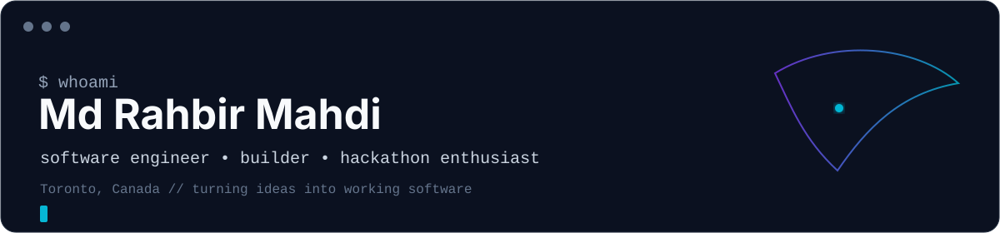
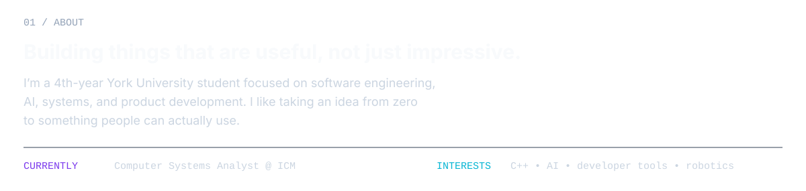
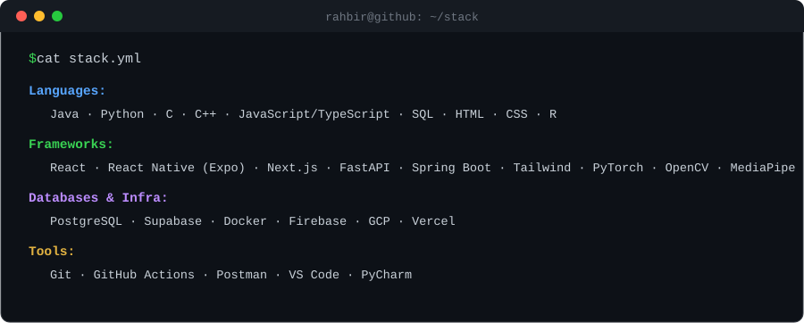
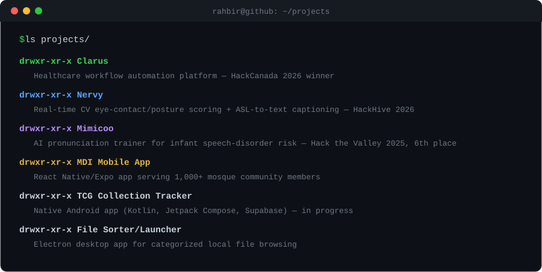
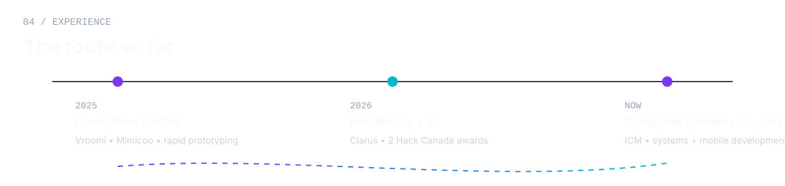

 

 

 

 

 

## 📊 GitHub Stats

 

## 🕹️ My Contribution Graph

<picture>
  <source media="(prefers-color-scheme: dark)" srcset="https://raw.githubusercontent.com/Rahbir1518/Rahbir1518/output/galaga-contribution-graph-dark.svg">
  <source media="(prefers-color-scheme: light)" srcset="https://raw.githubusercontent.com/Rahbir1518/Rahbir1518/output/galaga-contribution-graph.svg">
  
</picture>

 
 

